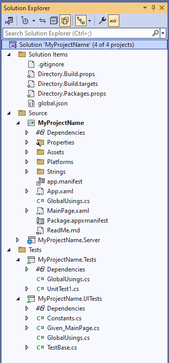

# How-To: Creating an application with tests

This tutorial will guide you through the process of creating an [Uno application along with tests](xref:Uno.GettingStarted.UsingWizard#10-testing).

> [!NOTE]
> Make sure to setup your environment first by [following our instructions](xref:Uno.GetStarted).
  
## 1. Exploring the Solution

The generated solution will contain:

* *MyProjectName* - for application logic, and other constructs like view models and services, as well as the pages, controls, and other views that make up the UI of the application.
* *MyProjectName.Tests* and *MyProjectName.UI.Tests* - for writing unit and UI tests respectively.



## 2. Running the Application

* Select a target from the drop-down as pictured below

    

* Click the "play" button, or press F5 to start debugging. The project will be compiled and deployed based on the target platform. For more detailed instructions specific to each platform, refer to the [Debug the App](xref:Uno.GettingStarted.CreateAnApp.VS2022#debug-the-app) documentation.

## 3. Running the Unit Tests

* In the Solution Explorer within Visual Studio, navigate to the *Tests* folder, and right-click on `MyProjectName.Tests`.

* From the context menu that appears, select *Run Tests*.

   The application will be compiled and the test cases will run.

> [!TIP]
> If the 'Run Tests' menu item doesn't exist, you need to Rebuild the solution to get Visual Studio to detect the available tests.

## 4. Running the UI tests

UI Tests are using the [Uno.UITest nuget package](xref:Uno.UITest.GetStarted), see the documentation for more information on how to create more UI Tests.

* As demonstrated on step 2, select the **MyProjectName (WebAssembly)** target from the drop-down.

* Press Ctrl + F5 to start the WASM project without debugging.

* Once the application is compiled, it will launch inside your default browser. Take note of the URL which should look something like this: https://localhost:5000/Main

* In the Solution Explorer, go to the *Tests* folder, open the `MyProjectName.UI.Tests` project, and locate the Constants.cs file.

* Open *Constants.cs* and update the WebAssemblyDefaultUri constant.

    It should appear similar to this:

    ```cs
    public readonly static string WebAssemblyDefaultUri = "https://localhost:5000/";
    ```

* Go back to the Solution Explorer, navigate to the *Tests* folder, right-click on the `MyProjectName.UI.Tests` project, and then select *Run Tests*.

    
