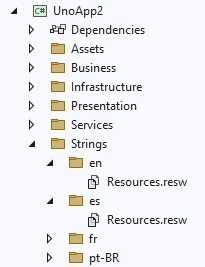

The settings on the Extensions page let you configure which Uno Extensions should be added to the solution and projects generated by the wizard.

Uno Extensions is a set of Extensions that cover common essentials application core building blocks and are supported on all operating systems Uno Platform targets.  
Uno.Extensions follow the Microsoft.Extensions model that creates a host environment where you can register additional dependencies. The registered dependencies are then available throughout the application via the Services (`IServiceProvider`) property on the [`IHost`](https://learn.microsoft.com/en-us/dotnet/api/microsoft.extensions.hosting.ihost) instance.
  
The available extensions are:
    
### Dependency Injection
Dependency Injection (DI) is an Inversion of Control (IoC) technique that enables consuming classes not to worry about the management or creation of their dependencies and instead rely on a central service to provide it when needed, based on how the provider was configured.  

Uno Platform brings the power of [Microsoft Extensions Dependency Injection](https://learn.microsoft.com/en-us/dotnet/core/extensions/dependency-injection) to all OSs Uno Platform targets and adds its additional functionality via its Uno.Extensions.DependencyInjection library, which you can learn more about [here](xref:Overview.DependencyInjection).  

This is included by default in the recommended preset, but not in the blank preset.

> [!NOTE]
> Some other features (e.g. Configuration, Http, Authentication as well as others) depend on DI and will be disabled if DI is not enabled.

```
dotnet new unoapp -di
```

### Configuration

This extension provides a way to load application configuration data from and to various sources using the [Options Pattern](https://learn.microsoft.com/en-us/dotnet/core/extensions/options). This is included by default in the recommended preset, but not in the blank preset.

Refer to the [Uno Configuration](xref:Overview.Configuration) documentation for more information.

```
dotnet new unoapp -config
```

### HTTP
Uno.Extensions.Http allows for the registration of API endpoints as multiple typed HttpClient instances. In this centralized location for accessing web resources, the lifecycle of the corresponding HttpMessageHandler objects is managed. Added clients can optionally be configured to use the platform-native handler. Additional functionality is provided to clear cookies or log diagnostic messages in responses. This library uses Microsoft.Extensions.Http for any HTTP-related work. This is included by default in the recommended preset, but not in the blank preset.

For more documentation on HTTP requests, [read the documentation](xref:Overview.Http).

Refer to the [documentation](xref:Overview.Http#refit) to learn how to use it in an Uno Platform app.

```
dotnet new unoapp -http
```


### Localization 
The Localization extension is responsible for managing globalization in your app.  
This enables keeping all translations of your app in a single place and enables the user to easily switch the UI language.

The generated app contains *resw* files which can be used to define the application strings. The defined languages are configured in *appsettings.json*. Follow [this link](Learn.Tutorials.Localization.HowToUseLocalization#3-update-the-ui-culture-with-localizationsettings) to learn how to switch the UI culture.



The default settings come with the following pre-set languages: English (*en*), Spanish (*es*), French (*fr*), and Portuguese - Brazil (*pt-BR*).

Uno.Extensions.Localization expands [Microsoft.Extensions.Localization](https://learn.microsoft.com/en-us/dotnet/core/extensions/localization) to all OSs supported by Uno Platform.  

This is included by default in the recommended preset, but not in the blank preset.

Read the full Localization documentation [here](xref:Overview.Localization) or learn more about [Globalization](https://learn.microsoft.com/en-us/dotnet/core/extensions/globalization).

```
dotnet new unoapp -loc
```

### Navigation  

- #### Regions
  Navigation is an integral part of any app and for that, Uno Platform has developed a navigation system that is registered and served using DI and is fully integrated with the navigation-specific UI controls out there, such as `Frame`, `NavigationView`, and `TabBar`.  

  It is a region-based navigation. A Region is the abstraction of the view responsible for handling navigation. Regions are structured into a logical hierarchical representation that shadows the navigation-aware controls in the visual hierarchy. The hierarchy allows navigation requests to be propagated up to the parent and down to child regions as required.  
  This library is also responsible for showing pop-ups, flyouts, dialogs, and other interactions with the user. 

  This is the default navigation in the recommended preset.

  Learn more about Uno's Navigation library [here](xref:Overview.Navigation).

  ```
  dotnet new unoapp -nav regions
  ```

- #### Blank
  Provides the default [WinUI frame navigation](https://learn.microsoft.com/en-us/uwp/api/windows.ui.xaml.controls.frame). This is the default navigation in the blank preset.

  ```
  dotnet new unoapp -nav blank
  ```


### Logging  
Logging is a crucial component in an app that enables the developer to emit log messages whenever an important action or execution is taken by the app. This then lets you trace back any errors or issues that may arise in the future.
There are several Logging tools out there, with one of the most common of them being [Microsoft.Extensions.Logging](https://learn.microsoft.com/en-us/dotnet/core/extensions/logging).  

Uno Platform provides its Uno.Extensions.Logging to bring Logging to all platforms it supports.

Uno.Extensions.Logging is covered in more detail [here](xref:Overview.Logging).

- #### Console
  Generates an app configured to write debug-level logging information to the Console. This is the default logging in the blank preset.

  ```
  dotnet new unoapp -log none
  ```

- #### Default
  Generates an app that uses Dependency Injection to configure logging that writes output to Console. This is the default logging for the recommended preset.

  ```
  dotnet new unoapp -log default
  ```

- #### Serilog 
  Generates an app that uses Dependency Injection to configure logging with [Serilog](https://github.com/serilog/serilog).

  ```
  dotnet new unoapp -log serilog
  ```


Refer to the [Logging](xref:Overview.Logging) documentation for more information.
